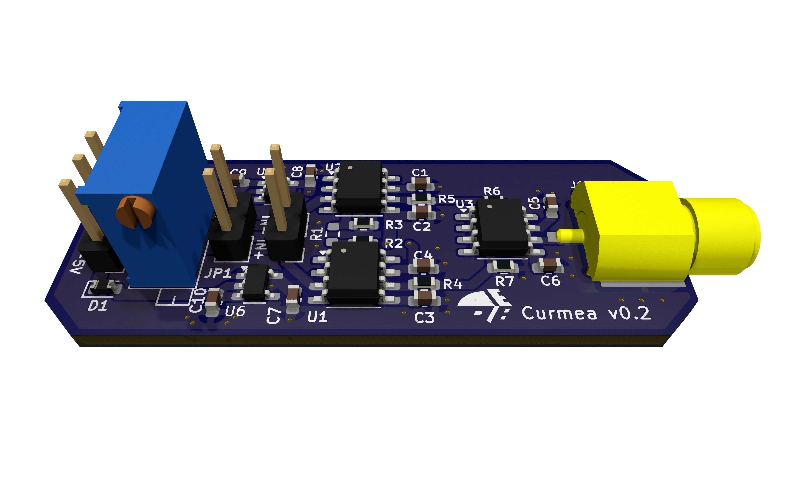

# Curmea

Curmea is an open-source hardware power analysis device, designed for hardware security research.

## Purpose of the device

To analyze the power consumption of a component, it is common to measure the current going to the ground by placing a small resistor and measuring the voltage across it. However, when the component cannot be isolated from the entire system, it can be challenging to obtain a direct line from the component to the ground without interference from other components. Additionally, the component itself may have multiple ground lines, causing the current to split into several paths.

Some electronic configurations of devices gives a simplier access from the power supply pin of the component.
The tradeoff of this configuration is that a differential probe is needed and the input voltage is reduced by the input resistor.

## Schematic description

The board is based on the [Instrumentation amplifier](https://en.wikipedia.org/wiki/Instrumentation_amplifier) coupled with [low-dropout regulators](https://en.wikipedia.org/wiki/Low-dropout_regulator) to power supply the amplifiers at -2.5v to 2.5v range.

## Development status

This work is currently in progress and not fully tested and optimized.
